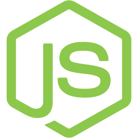

# Hi there I'm Udin & I'm Learning
- 🌱 I'm currently working on a project that is multiplatform focusing on mobile technology.
- 📝 I'm currently learning [JavaScript], [Flutter].
- 🥅 2037 Goals: Survive.
- 😇 Fun fact: Spent most of my time bedrotting.

### Connect with me: 

&nbsp;&nbsp;

&nbsp;&nbsp;

&nbsp;&nbsp;

&nbsp;&nbsp;

&nbsp;&nbsp;

### Language and Tools:
[][vscode]
[][bash]
[][python]
[][html5]
[][css3]
[][javascript]
[][nodejs]
[][mongodb]

<picture>
  <source media="(prefers-color-scheme: light)" srcset="./img/tools/github-dark.png">
  <source media="(prefers-color-scheme: dark)" srcset="./img/tools/github-light.png">
  
</picture>

[][linux]
[][windows11]

 
 

🔨 Latest Project

<!-- START_SECTION:activity -->
1. 👷‍♂️ Working PR in [World Time]
2. 📱 Open PR in [WDMS App]
3. ❌ Closed PR in [Markdown Blog]

  ➡️ [more projects...]
<!-- END_SECTION:activity -->

😱 Cool Stuff

<!-- START_SECTION:activity -->
1. 🐧 [Ultimate Guide For Beginner Linux User] 👉 Linux stuff + usefull scripts
2. 📜 [Windows Scripting] 👉 Windows Automation Script
3. 🌐 [Markdown Blog] 👉 blog rendered using markdown text
4. 🌐 [YouTube Downloader] 👉 download youtube videos using yt-dlp & ffmpeg
5. 📱 [Better PWA] 👉 turn websites into android app with custom links
<!-- END_SECTION:activity -->

[Flutter]: https://flutter.dev
[electron]: https://www.electronjs.org/
[JavaScript]: https://www.javascript.com/
[python]: https://python.org
[Bash Script]: https://www.freecodecamp.org/news/shell-scripting-crash-course-how-to-write-bash-scripts-in-linux/

[website]: https://get543.github.io/portfolio-tailwindcss
[discord]: https://discord.com/
[telegram]: https://telegram.org/
[twitter]: https://www.twitter.com
[instagram]: https://www.instagram.com
[youtube]: https://www.youtube.com

[vscode]: https://code.visualstudio.com/
[bash]: https://www.gnu.org/software/bash/
[cpp]: https://www.cplusplus.com/
[html5]: https://www.w3schools.com/html/html_intro.asp
[css3]: https://www.w3schools.com/css/
[javascript]: https://www.javascript.com/
[nodejs]: https://nodejs.org/en/
[mongodb]: https://www.mongodb.com/
[github]: https://github.com/
[linux]: https://en.wikipedia.org/wiki/Linux
[windows11]: https://www.microsoft.com/en-us/software-download/windows11

[Windows Scripting]: https://github.com/get543/Windows-Scripting
[Markdown Blog]: https://github.com/get543/Markdown-Blog
[World Time]: https://github.com/get543/world_time
[WDMS App]: https://github.com/get543/wdms-app
[more projects...]: https://github.com/get543?tab=repositories

[Ultimate Guide For Beginner Linux User]: https://github.com/get543/linux-beginner-guide/blob/main/Ultimate%20Guide%20For%20Beginner%20Linux%20User.md
[MuSicBot]: https://github.com/get543/musicbot
[Better PWA]: https://github.com/get543/better_pwa
[YouTube Downloader]: https://github.com/get543/youtube-downloader
